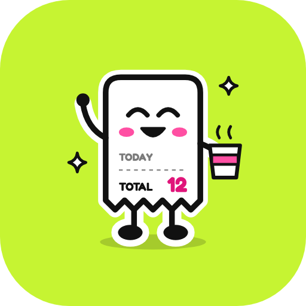
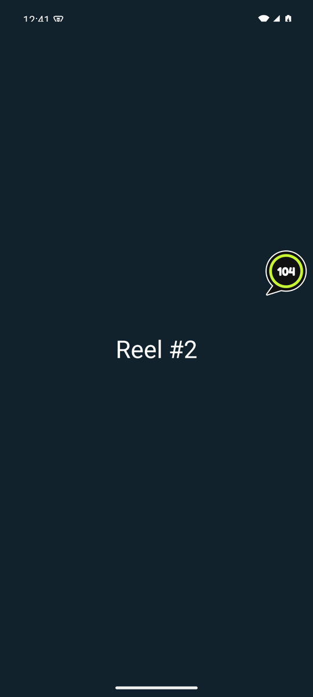
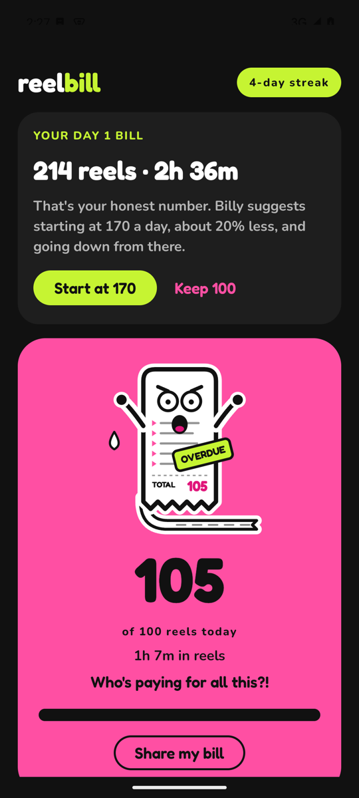
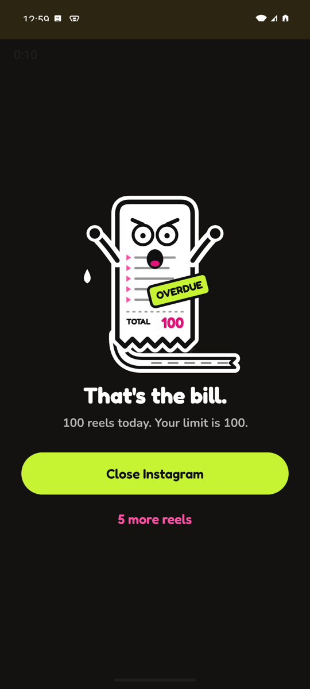
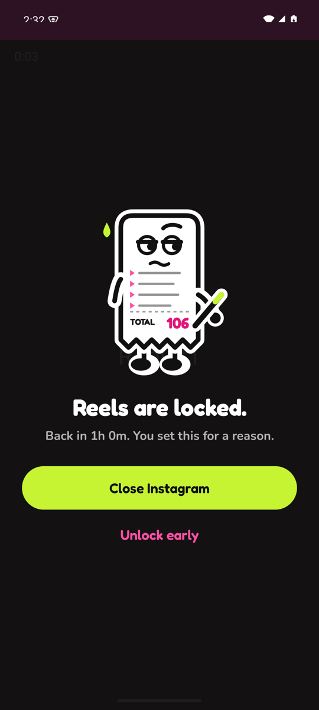
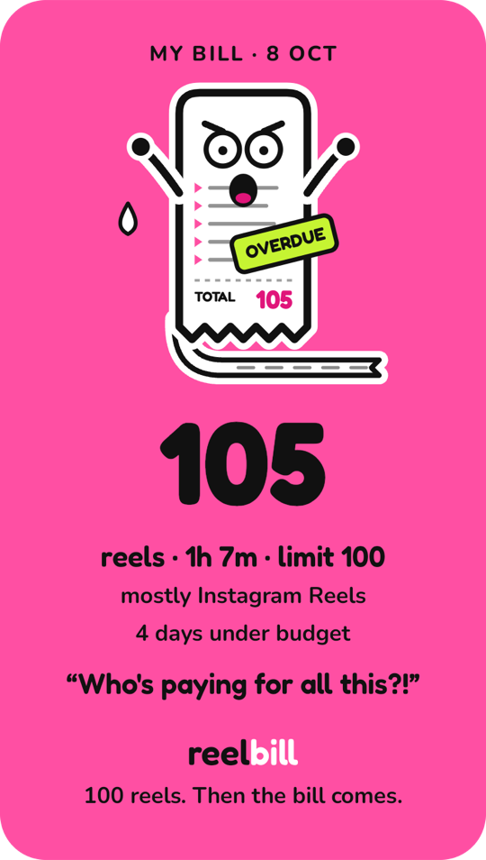
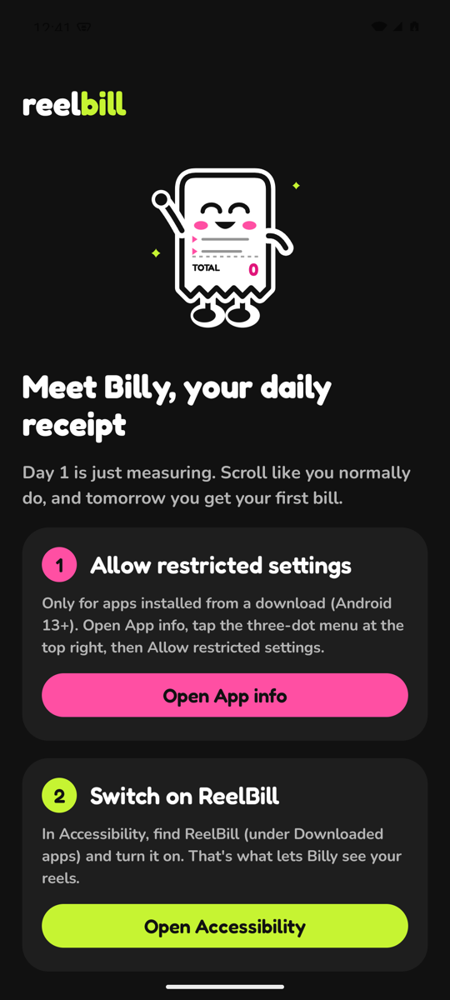
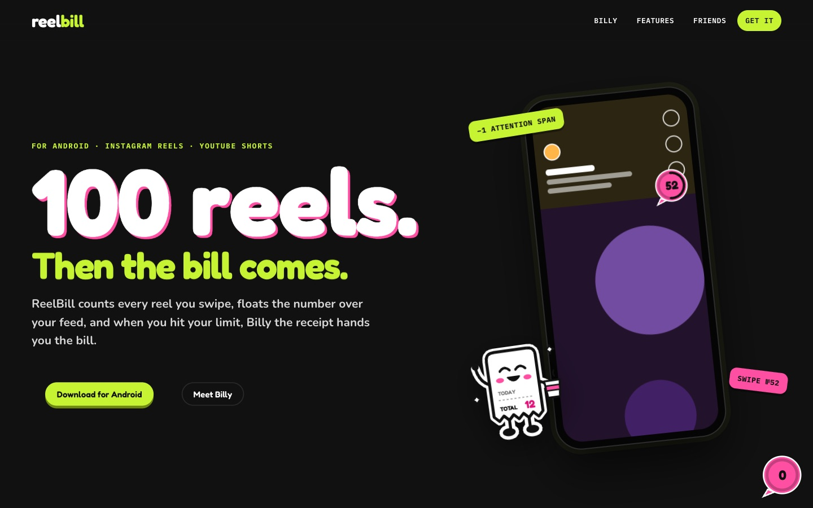

  

<h1 align="center">ReelBill</h1>

<b>100 reels. Then the bill comes.</b>

  
  
  
  

  
  
  
  
  
  
  
  
  

  <a href="https://reelbill-app.vercel.app">Website</a> ·
  <a href="https://github.com/sidhy4rth/ReelBill/releases/latest">Android 1.0.0</a> ·
  <a href="docs/HOW-IT-WORKS.md">How it works</a>

  

ReelBill counts every reel and short you swipe, floats the number over your feed, and
when you hit your limit, Billy the receipt hands you the bill. Day 1 just measures, so
you start from an honest number. After that it's a daily limit, a bubble that keeps
count, and a mascot who gets more dramatic the longer the day goes.

- **A bubble on every reel.** A pink counter floats over Instagram Reels, YouTube Shorts,
  Moj and Josh, ticks up with each swipe, and turns black when the bill is due.
- **Billy.** A receipt with feelings. He prints your real total on himself, grows as the
  count climbs, gives side-eye near the limit, and gets stamped OVERDUE past it.
- **Hard stops when you want them.** *Kick me out* covers the reels at your limit;
  *Study lock* blocks them for a set time, from 30 minutes to midnight.
- **Friends.** Add people by @username. Fewest reels wins the week. Friends see your
  weekly total and streak, never what you watched.
- **Acid.** Hot pink, lime and ink. Fredoka for anything Billy says, Nunito for the rest,
  and springy motion everywhere: the receipt prints, the bubble squishes, the stamp slams.

---

## Features

| | |
|---|---|
| **Floating counter** | The bubble over every reel. Drag it anywhere, long-press to hide it for 30 minutes. |
| **Day 1 bill** | 24 hours of honest measuring, then a suggested first limit about 20% under it. |
| **Daily limit + nudges** | 100 by default. Billy checks in at half, three quarters, five left, the limit, and every ten over. |
| **Kick me out** | Opt-in. At the limit a full-screen Billy covers the reels: close the app, or take five more. |
| **Study lock** | 30m, 1h, 2h or till midnight. Opening Reels during a lock puts Billy at the door. |
| **Bedtime mode** | Reels off every night, 11 PM to 7 AM or whatever you set. "Not tonight" skips one night. |
| **Pause before reels** | Opt-in. A breathing Billy before Reels opens; Continue unlocks after five seconds. |
| **Time in reels** | How long, not just how many. |
| **Streaks and trends** | Days under the limit, this week vs last, and the hour you scroll most. |
| **Morning bill** | Yesterday's total, around 9 AM. |
| **Weekly bill** | Monday morning: last week's total, average, best and worst day, and the change. |
| **Step-down plan** | Opt-in. A full week under your limit and Billy lowers it by about 10%. |
| **Stickers** | Nine to collect: streaks, a zero-reel day, a kept lock, a 20% better week, and more. |
| **Pick your apps** | Switch counting off for any of the four apps. |
| **Share your bill** | Today's receipt as an image for the story or the group chat. |
| **Widget + Quick Settings tile** | Billy on the home screen; one tap locks reels for an hour. |
| **Cloud backup** | Counts and streaks survive a reinstall or a new phone. |
| **Friends leaderboard** | Weekly ranking with people you've both agreed to compare with. |
| **Poke a friend** | Send one of Billy's lines ("Go touch grass."). Arrives in seconds; once an hour per friend. |
| **Hinglish Billy** | "Ye bill kaun bharega?!" Billy's lines, nudges and screens in Hinglish. |
| **Month calendar** | Every tracked day, lime under the limit and pink over, month by month. |
| **Smart bedtime** | Scroll most late at night? Billy suggests a bedtime just before your peak. |
| **Export** | All your days as a CSV file. |
| **Delete my account** | One tap (and your password) erases your backups, friends, pokes and login. |

## Screens

  
  &nbsp;
  
  &nbsp;
  

  
  &nbsp;
  
  &nbsp;
  

  

## The website

  

[reelbill-app.vercel.app](https://reelbill-app.vercel.app) bills *you* for scrolling it.
Its source is in [`site/`](site): plain HTML, CSS and JavaScript with GSAP.
A bubble counts every screenful as a reel; a pinned scene lets your scroll drive Billy
from 0 to 104; the features print out of a receipt printer; and at the bottom you get
your own receipt for reading the page.

## Privacy

ReelBill watches four apps (Instagram, YouTube, Moj, Josh) and counts swipes in them.
It never reads messages, captions, comments or anything you type. Counts are backed up
to your account so a new phone keeps your streak; friends see only a weekly summary,
and only after you've both accepted. Signing out clears the phone, and *Delete my account*
erases everything, login included. Details in [How it works](docs/HOW-IT-WORKS.md#privacy)
and [Security](docs/HOW-IT-WORKS.md#security).

## How it works

The app's source is private (the website's is in [`site/`](site)).
[docs/HOW-IT-WORKS.md](docs/HOW-IT-WORKS.md) explains the
moving parts: how a swipe becomes a count, how the bubble draws over other apps without
the "display over other apps" permission, how Billy's moods are decided, and how the
friends handshake and security rules keep each person's data their own.

The CI badges above run against the real source on every push: the Android build, unit
tests and lint, and the Firestore security-rules suite.

---

Made by <a href="https://github.com/sidhy4rth">sidhy4rth</a> · Android only · Not affiliated with Instagram or YouTube.

