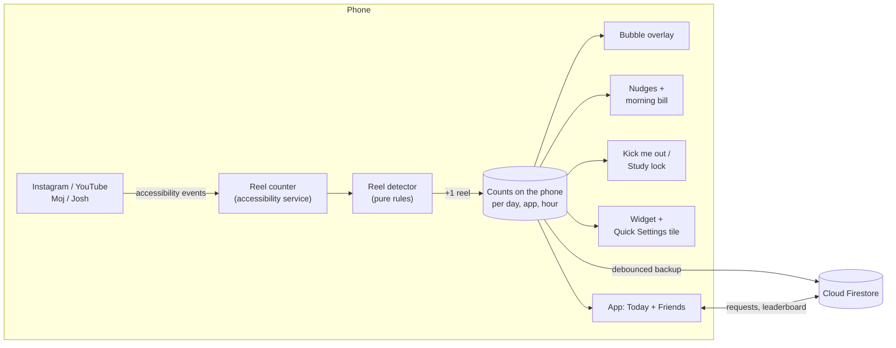
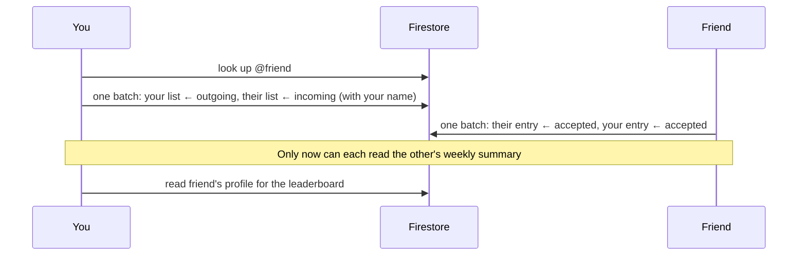

# How ReelBill works

A tour of the moving parts: what happens between your thumb moving and Billy getting
stamped. The source is private; this explains the design, not the code.

- [The big picture](#the-big-picture)
- [Counting a reel](#counting-a-reel)
- [The bubble](#the-bubble)
- [Billy's moods and nudges](#billys-moods-and-nudges)
- [Kick me out and Study lock](#kick-me-out-and-study-lock)
- [Bedtime, pause and step-down](#bedtime-pause-and-step-down)
- [Insights](#insights)
- [Stickers and the weekly bill](#stickers-and-the-weekly-bill)
- [Accounts, backup and friends](#accounts-backup-and-friends)
- [Morning bill, widget and tile](#morning-bill-widget-and-tile)
- [Privacy](#privacy)
- [How it's tested](#how-its-tested)
- [The website](#the-website)

---

## The big picture

Everything that decides *whether a reel happened* runs on the phone, from accessibility
events, with no network involved. The cloud only stores a backup of the counts and the
small weekly summary friends can see.

## Counting a reel

ReelBill is an Android **accessibility service** that subscribes to exactly four apps.
Android delivers it three kinds of events from those apps: windows changing, content
changing, and views scrolling. Nothing else on the phone reaches it.

**1 · Is a reels viewer on screen?**
Each app's full-screen reels player is a vertical pager with a stable internal name.
Instagram's Reels viewer and YouTube's Shorts player are recognised by those view ids;
Moj and Josh are short-form everywhere, so any vertical list in them counts. If the
scrolling view is an unnamed list nested inside the named viewer, the service walks a
few levels up the view tree to find it.

**2 · Did the user move to a new reel?**
A small, fully unit-tested rule set (the *reel detector*) turns raw events into "one
more reel":

| Situation | Rule |
|---|---|
| Opening Reels or Shorts | The reel you land on counts once. Coming back after 5 s away counts again. |
| The pager reports which item is on screen | One reel each time that index changes. |
| It doesn't | One swipe arrives as a burst of scroll events less than 450 ms apart. A burst counts once, as soon as it has moved 120 px. |
| A sideways carousel | Ignored. |
| A layout "scroll" right after opening the viewer | Ignored for 700 ms; the landing already counted that reel. |
| Events from an app in the background | Ignored; only the app in front counts. |

**3 · Store it.** Counts live on the phone, keyed by day, app and hour, so a new day starts
at zero without any reset job. The first 24 hours after install are the **measuring
day**: everything is counted, nothing is judged.

## The bubble

The bubble is a window drawn by the accessibility service itself, as an *accessibility
overlay*. That window type is allowed to sit on top of other apps, so ReelBill needs no
separate "display over other apps" permission.

- It appears only while a reels viewer is on screen, and hides about 1.5 s after you
  leave the app: windows from unwatched apps are invisible to the service, so a moment
  of not seeing the reels app in front means you've gone.
- Drag it anywhere; it springs to the nearest screen edge. Tap opens ReelBill.
  Long-press hides it for 30 minutes while counting carries on.
- The ring shows progress to your limit. At the limit the bubble pops, wobbles and turns
  black with a lime ring.

## Billy's moods and nudges

Billy is drawn in code, so he can print your real number and change in-between frames.

| Today vs your limit | Billy | |
|---|---|---|
| Measuring day | Waving, receipt half-printed | "Day 1. Scroll like normal, I'm just keeping the receipt." |
| 0 | Sparkles, coffee | "New day. Clean bill." |
| Under 75% | Happy, receipt growing | "Tiny bill. Love that for you." |
| 75% and up | Side-eye, tapping a pen | "I'm running out of paper here." |
| 95% and up | Side-eye, sweating | "Almost at the limit. Choose wisely." |
| 100% and over | Screaming, receipt spilling, stamped OVERDUE | "Who's paying for all this?!" |

Notifications fire once per threshold as the count crosses it: half, three quarters,
five left, the limit, then every ten over. A newer nudge replaces the last one instead
of stacking up. Nothing is sent on the measuring day.

## Kick me out and Study lock

Both put a full-screen Billy over the reels, again as an accessibility overlay, so the
reels underneath can't be swiped until you choose.

- **Kick me out** (opt-in): appears when today's total reaches the limit. *Close the
  app* takes you to the home screen; *5 more reels* lets you continue until the total
  passes the grace line, then Billy is back.
- **Study lock**: 30 minutes, 1 hour, 2 hours or until midnight, from the dashboard or
  the Quick Settings tile. Opening Reels during a lock puts Billy at the door with
  *Close* and *Unlock early*.
- Either screen leaves with you if you switch apps.

## Bedtime, pause and step-down

- **Bedtime** is a study lock that repeats every night: a start and end time (default
  11 PM to 7 AM) that may wrap past midnight. During it, opening Reels puts Billy at the
  door with *Close* and *Not tonight*. "Not tonight" is remembered against the night it
  belongs to, so 1 AM still counts as the previous evening and the lock is back tomorrow.
- **Pause before reels** (opt-in): arriving in a viewer brings up a breathing Billy. The
  *Continue* button stays locked for five seconds; *Close* is available straight away.
  It shows at most once every ten minutes, so scrolling back in after a message isn't
  punished.
- **Step-down plan** (opt-in): on Monday, if every tracked day of the past week (at least
  five) ended under the limit, the limit drops about 10%, in fives, never below 20.
- **Apps to track**: counting can be switched off per app; events from a switched-off
  app are ignored before anything else happens.

## Insights

- **Time in reels**: the service measures how long a viewer stays on screen and writes
  it out every 15 seconds.
- **Day 1 bill**: after the measuring day, a card shows that day's count and time and
  suggests a first limit about 20% under it, in tens, between 20 and 500.
- **Streak**: days in a row under the limit, counted back from yesterday. Today can't
  break a streak until it's over.
- **When you scroll**: reels per hour of day over the last week, peak hour highlighted.
- **This week vs last**: percentage change in the 7-day total.

## Stickers and the weekly bill

A small rules engine runs whenever the app opens and with the morning alarm. It
credits study locks that ran their full course (unlocking early forfeits it), issues the
**weekly bill** once per finished Monday-to-Sunday week, applies the step-down plan, and
awards **stickers**:

| Sticker | Earned by |
|---|---|
| First bill | Finishing the measuring day |
| Under budget | A finished day under the limit |
| Hat trick / Full week | A 3- or 7-day streak |
| Clean bill | A finished day with zero reels |
| Kept the lock | A study lock that ran its full course |
| Glow-up | A week at least 20% below the week before (both with 5+ tracked days) |
| Squad | Your first accepted friend |
| Receipts | Sharing your bill |

New stickers pop up the next time the app opens, or arrive as a notification when the
morning run earns them. Weekly reports only count days on or after the first full day
after install, so a week you installed midway isn't judged on days with no data.

## Accounts, backup and friends

Sign-up is required (email, or Google), followed by a name and a unique **@username**,
so the leaderboard shows real names. The username is claimed in a transaction, so two
people can't take the same one at once.

**What's stored where**

| Location | What | Who can read it |
|---|---|---|
| `users/{you}` | Settings: limit, install date, Day 1 baseline | Only you |
| `users/{you}/days/{date}` | Per-app counts, time in reels, counts per hour | Only you |
| `usernames/{name}` | Which account owns a @username | Anyone signed in (so friends can find you) |
| `profiles/{you}` | Name, @username, this week's total, today's total, streak | You, and friends you've accepted |
| `friends/{you}/list/{them}` | `outgoing`, `incoming` or `accepted` | Only you |

**Backup** is fire-and-forget: at most every 30 seconds the phone writes today, yesterday
and the weekly summary; Firestore queues the writes offline. Signing in on a new phone
brings back the last 90 days and *merges* them, keeping the larger figure for each
count, so nothing counted locally before sign-in is lost.

**The friends handshake**

**Security rules** enforce all of that on the server, not just in the app. You can only
write your own lists, except for exactly one entry in someone else's list (the one with
your id), and only to drop in a request, accept one they sent you, or remove it. You
can't accept your own request, plant entries for anyone else, claim a taken username,
or read a profile before both sides have accepted. Friends never get access to each
other's daily data.

## Morning bill, widget and tile

- **Morning bill**: an inexact daily alarm around 9 AM posts yesterday's total, the
  overage or the streak. The very first one presents the Day 1 bill. Alarms are
  rescheduled whenever the app starts, which Android does after a reboot when it
  re-binds the accessibility service.
- **Widget**: today's count, progress to the limit and Billy in three moods, refreshed
  on every counted reel. The app can ask the launcher to pin it.
- **Quick Settings tile**: shows today's count; a tap locks reels for an hour, another
  unlocks.

## Privacy

- ReelBill subscribes to accessibility events from four apps only, listed in the app's
  accessibility configuration. Android doesn't deliver events from any other app.
- From those apps it reads view names, scroll positions and whether a reels viewer is
  visible. It doesn't read captions, comments, messages, usernames or anything you type,
  and it doesn't record what any reel was.
- What leaves the phone: daily counts, time in reels, counts per hour, your settings,
  and the weekly summary friends see. Stored in Cloud Firestore in Mumbai
  (`asia-south1`), behind the rules above.

## How it's tested

- **Unit tests** (44) cover the reel detector (landing, index changes, swipe bursts,
  carousels, layout noise), moods, nudges, streaks, Day 1 suggestions, durations, locks,
  bedtime windows across midnight, the pause cooldown, step-down, weekly reports and
  every sticker rule.
- **Security-rules tests** run the real rules on the Firestore emulator: private data,
  username claims, the full friend handshake, and the attacks above (15 cases).
- **End to end on an emulator**: a test-only "fake reels" app borrows Instagram's
  package name and viewer id, so the real service, detector, bubble, kick-out screen,
  locks, bedtime, the pause and notifications run exactly as they would on a phone.
  Verified: landing plus ten swipes counts exactly 11.
- **Against the live backend**: temporary accounts sign up, send and accept a friend
  request, back up, wipe the app and restore, then get deleted.
- **CI** runs the Android build, unit tests, lint and the rules suite on every push.

## The website

[reelbill-app.vercel.app](https://reelbill-app.vercel.app) is a static page with GSAP
scroll animations, built around one idea: the page bills you for scrolling it. A bubble
counts every screenful as a reel, a pinned scene lets your scroll drive Billy from 0 to
104, features print out of a thermal-receipt printer, a kick-out takeover blocks the
page, and at the end you get your own receipt for reading it. It respects the
reduced-motion setting.
